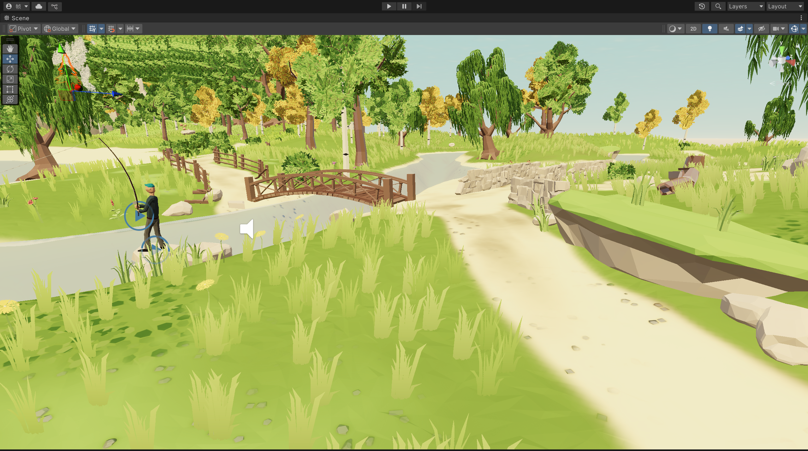

# VR_Hiking Project

This project is developed using **Unity 2022.3.55f1c1** and **PICO 4** device to create a virtual hiking system. It aims to provide users with an immersive outdoor scenery experience in virtual reality. When combined with treadmills or similar equipment, it allows users to enjoy the fun of outdoor hiking indoors while achieving physical exercise benefits.

## Usage

- `VR_Hiking.unitypackage` contains the packaged scene along with its dependent assets and scripts. To use it, in a new Unity project, navigate to: Assets → Import Package → Custom Package, select this `.unitypackage` file, check all the contents, and import. Afterward, you can view all the contents of this project in the new Unity project.

-  `VR_Hiking_PICO4_build.apk`  is the APK built for the specified PICO4 device after connecting the project.

- `VR_Hiking_allCompatible_build.apk`  is the APK obtained by setting the project build to be compatible with all supported devices.

You can just upload the APK to a PICO4 device for installation and execution.

## More info

This project was developed as the final assignment for the course *"Virtual Reality and Data Visualization", Zhuying Li, SEU* . Due to tight deadlines (less than three days), we had limited development time, resulting in minimal interaction between the character and environment. Only basic movement was implemented.

For the project's development, we referenced scenes from the [**Unity Asset Store**](https://assetstore.unity.com/) and utilized numerous prefabs to construct our environment. After continuous adjustments to Unity's settings, we successfully optimized and deployed the project to run on **PICO 4**.